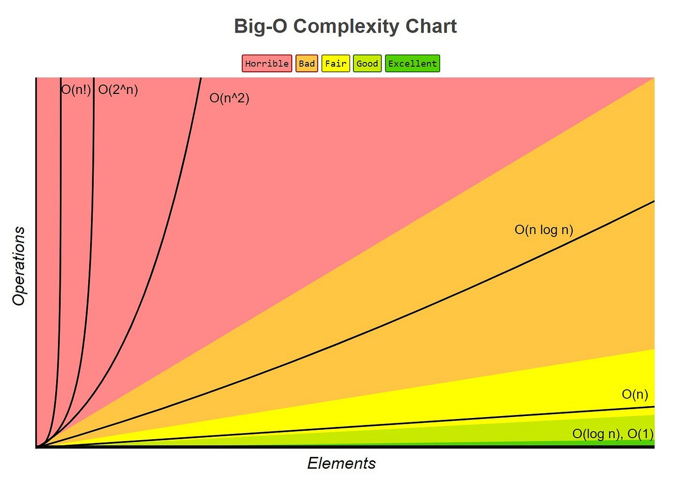

# Algorithms



| notation   | name    |
|--------------- | --------------- |
| O(1)   | constant   |
| O(log n)   | logarithm   |
| O(n)   | linear   |
| O(n * log n)   | ---   |
| O(n²) | quadratic |
| O(n³) | cubic |
| O(n^c) | polinomial |
| O(c^n) | exponential |
| O(n!) | factorial |

- Adaptive: Faster for partially sorted data sets
- Stable: Does not change the relative order of elements with equal keys
- In-Place: Only requires a constant amount of memory
- Online: Can sort a list as it receives it

## Bubble Sort

- Summary
  - Switch pair of elements n² times so that the bigger element goes to the right
  - Easy to implement
  - Slow
  - low memory usage
- Time complexity
  - worst case: O(n²)
  - average case: O(n²)
  - best case: O(n)
- Space complexity
  - O(1)

```python
def bubblesort(nums):
    for j in range(len(nums)):
        for i in range(len(nums)-1-j):
            print(nums)
            if nums[i] > nums[i+1]:
                buffer = nums[i+1]
                nums[i+1] = nums[i]
                nums[i] = buffer
    return nums
```

## Selection Sort

- summary
  - slow
  - OBS: SeLectiOn sort => SLOw
  - OBS: Select Smallest and Swap
  - in-place
  - not stable
  - simple implementation
- pseudocode
  - split values into sorted and unsorted
    - sorted section begins empty
  - select smallest value in all unsorted section
  - swap smallest value with rightmost/last position of sorted section
  - repeat
- time complexity
  - worst case: O(n²)
  - average case: O(n²)
  - best case: O(n²)
- space complexity
  - O(1)

## Insertion Sort

- Summary
  - OBS: (insert) unsorted element into correct position
  - Slow
  - Simple implementation, easy to write
  - Faster than other simple sorting algorithms like Bubble Sort
  - Adaptive: Faster for partially sorted data sets
  - Stable: Does not change the relative order of elements with equal keys
  - In-Place: Only requires a constant amount of memory
  - Online: Can sort a list as it receives it
- Pseudocode
  - Separate the array into 2 parts: sorted and unsorted section
  - Pick the first element of the unsorted and insert it into correct position in sorted section
  - Put the unsorted element in the correct position in the sorted section
  - sort the next element of the sorted section
- Time complexity
  - worst case: O(n²)
  - average case: O(n²)
  - best case: O(n²)
- Space complexity
  - O(1)

```python
def insertion_sort(nums):
    for i in range(len(nums)):
        j = i
        while j > 0 and nums[j - 1] > nums[j]:
            nums[j], nums[j - 1] = nums[j - 1], nums[j]
            j -= 1
    return nums
```


## Quick Sort

- Summary
  - Divide and conquer
  - Pick a pivot element and partition the array around the pivot
  - Recursively sort the sub-arrays
    - all elements less than the pivot are on the left
    - all elements greater than the pivot are on the right
    - the pivot is in the correct position
  - In-place
  - Fast (but not always)
  - High memory usage
- Pseudocode
  - Select an element that will be the pivot
  - Move all elements that are smaller than the pivot on the left of the pivot
  - Move all elements that are greater than the pivot on the right of the pivot
  - Run quicksort on the left segment of the array
  - Run quicksort on the right segment of the array
- Time complexity
  - best case: O(n * log n)
  - average case: O(n * log n)
  - worst case: O(n²)
- Space complexity
  - O(log(n))

## Merge Sort
- Summary
  - Fast
  - Uses a lot of memory
  - Divide and conquer
- Pseudocode
  - Splits unsorted array recursively in two
  - After splitting, it merges 2 arrays by creating a third and iterating through the 2 initial arrays, comparing the elements and adding the smallest
- Time complexity
  - best case: O(n * log n)
  - average case: O(n * log n)
  - worst case: O(n * log n)
- Space complexity
  - O(n)

## Shell Sort

- summary
  - improvement of Insertion sort
  - gap
- pseudocode
- time complexity
  - best case: O(n * log n)
  - average case: depende do gap
  - worst case: O(n²)

## Heap Sort

- summary
  - uses heap data structure
- pseudocode
- time complexity
  - best case: O(n * log n)
  - average case: O(n * log n)
  - worst case: O(n * log n)

# data search

- sequential/linear search
- binary search
  - sort array
  - compare middle value with target value
  - if middle is equal to target, stop and return current position
  - if middle is bigger than target, discard the half with the bigger numbers and binary search the remaining array
  - if middle is smaller than target, discard the half with the smaller numbers and binary search the remaining array

---

# Data Structures

## Linked List

## Queue

