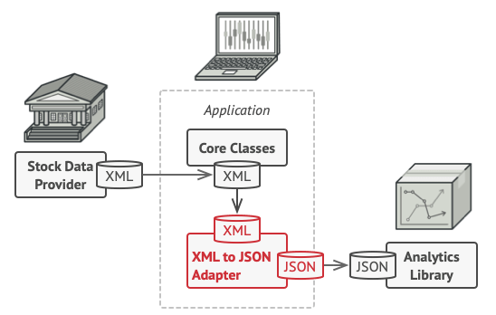

[design patterns](./design_patterns.md)

# Design Patterns

[catalog of design patterns](https://refactoring.guru/design-patterns/catalog)

> reusable solutions to common problems in software design

- provide proven solutions
- improve code readability and maintainability
- facilitate communication
- encourage best practices
- speed up development process

## Creational patterns

> Object creation mechanisms

### Abstract Factory

> Interface to create related or dependent objects without specifying their concrete classes

### Singleton

> garantees that a class has only 1 instance

Implementation:

- Make default constructor private, to prevent new instances from being created
- create a static method that returns the same instance of its own class
  - getInstance should be the only way of getting Singleton object

### Builder

> allows you to produce different types and representations of an object using the same construction code

Implementation:

- Abstract the object constructions code out of its own class

### Prototype

> reuse existing objects without making code dependent on their classes

- an object that supports cloning is called a prototype

Implementation:
- Add a clone() method that carries over all of the field values of the old object into the new one

## Structural patterns

### Adapter

> allows objects with incompatible interfaces to collaborate

### Bridge

> allows to split a large class or a set of closely related classes into two separate hierarchies—abstraction and implementation—which can be developed independently of each other

- problem occurs when you when you extend two independent dimensions
- the bridge pattern solves this problem by creating two separate hierarchies
  - abstraction
    - e.g.: GUI of the app
  - implementation
    - e.g.: the operating system's API

### Composite

> Composite is a structural design pattern that lets you compose objects into tree structures and then work with these structures as if they were individual objects

- this design pattern is used when you need to implement a tree-like structure

### Decorator/Wrapper

> lets you attach new behaviors to objects by placing these objects inside special wrapper objects that contain the behaviors

### Facade

> provides a simplified interface to a library, a framework, or any other complex set of classes

- it's a filter for functionalities
- hides the complexity of the system

### Flyweight

> improves RAM usage by sharing data between multiple objects instead of keeping all of the data in each object

- use this pattern only when your program must support a huge number of objects which barely fit into available RAM
- each object's attributes define its state, there are 2 types of state:
  - intrinsic state: data that is shared across multiple objects
    - other objects can read it, but not change it
    - an object that only stores the intrinsic state is called a flyweight
    - flyweight objects are immutable
  - extrinsic state: data that is NOT shared across multiple objects
    - don't store it inside the object
    - pass this state to specific methods

### Proxy

> a proxy intermediates communication to the original object, allowing you to perform something either before or after the request gets through the original object

- use cases:
  - when a heavyweight service object can't be always available because it wastes too many resources
  - when only specific clients should use it, restrict access to the service object

## Behavioral patterns

> Focus on algorithms and assignment of responsibilities between objects

### Chain of Responsibility (CoR)

> passes request along a chain of handlers. Upon receiving a request, each handler decides either to process the request or to pass it to the next handler in the chain

- similar to telecom companies' services
- you will create many objects called handlers
- each handler has a field that stores a reference to next handler
- all handlers will implement the same interface (look at the link at the beginning of this .md file)

- use cases:
  - you need process different types of requests in various ways and the exact types of requests beforehand are unknown
  - when it's essential to execute several handlers in a particular order
  - when the set of handlers and their order are supposed to change at runtime

### Command

> converts request into a stand-alone object that contains all info about request

- real world comparison: waiter taking orders in restaurants
- lets you:
  - pass requests as method arguments
  - delay request's execution
  - queue request's execution
  - support undoable operations

### Iterator

> 

### Mediator

### Memento

### Observer

### State

### Strategy

### Visitor
