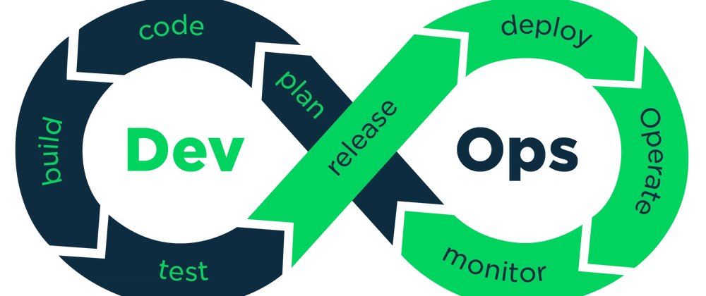

[github actions](./github_actions.md)
[docker](./docker.md)
[kubernetes](./kubernetes.md)
[ansible](./ansible.md)

# DevOps

> set of practices that combines software development (Dev) and IT operations (Ops) to shorten the development lifecycle while delivering features, fixes and updates frequently and reliably

- combination of culture, practices and tools that increases an organization's ability to deliver applications and services



## basic concepts

[summary](https://dev.to/aws-builders/system-design-for-devops-engineers-45lh)

- core principles:
  - automation
  - collaboration and communication
  - continuous improvement
  - CI/CD
    - Continuous Integration (CI): practice of automatically integrating code changes from developers into shared repository
      - verify each integration with automated builds and tests to detect problems early
    - Continuous Deployment/Delivery (CD): process of automatically deploying code changes to production environment after the code has been built and tested
  - version control
  - infrastructure as code: practice of managing computing infrastructure with configuration files instead of manually
    - benefits
      - consistency: ensures that environments are configured the same way every time, eliminating manual errors
      - repeatability: spin up identical environments (e.g. dev, staging, prod) easily
      - faster provisioning
      - track changes: allow rollbacks and audit history
      - collaboration: teams can review and approve infrastructure changes like application code via pull requests
      - automation
      - documentation
      - clear configuration
  - microservices architecture: architecture where a large application is split into smaller, independent services
  - monitoring and logging
  - security integration (DevSecOps)

- benefits:
  - shorter release cycle
  - faster time to market
  - improved collaboration
  - better quality code
  - reduced development costs
  - increased consistency and reliability
  - faster problem resolution
  - enhanced security

- tools commonly used for:
  - version control: git
  - CI/CD: GitHub Actions, GitLab CI, Jenkins
  - containerization: docker
  - orchestration: kubernetes
  - infrastructure: ansible, terraform
  - monitoring: prometheus, grafana

- good practices for a CI/CD pipeline:
  - deterministic builds: The same code should always produce the same build
  - fast builds: The faster the better. This makes getting bug fixes and new features out to users faster
  - portable: This is why I love when the majority of a CI/CD pipeline is just bash scripts
    - easier to run locally and on any CI/CD platform
  - fully automated: The fewer manual steps, the better
    - less error-prone

## introducing devops in workplace

### understand and automate

- how developers work?
- what workflows do they use?
- what git workflow?

- how to provision and prepare infrastructure
- how to maintain infrastructure

- which processes can be automated with a CI/CD pipeline?
  - building, testing, deploying and infrastructure provisioning
  - automate the process of releasing software to different environments (staging, production)
- what can be containerized?

- add monitoring + logging in infrastructure/application
  - use tools like Prometheus, Grafana, Amazon CloudWatch

> [!TIP]
> automate the most time-consuming and error-prone processes first

## CI/CD example step by step

> objective: program workflow that builds docker image and pushes it to GCP's [artifact registry](/gcp.md#artifact-registry)

[example of ci workflow](./code/workflows/ci.yml)
[example of cd workflow](./code/workflows/cd.yml)

### short step by step description

1. program workflow to build and push artifact (in this example github actions)
1. configure repository to store artifact (in this example Google's artifact registry)
1. generate credentials/keys so that the workflow is able to push to the repository
1. add credentials/keys as repository secrets in github repo (`github repo > settings > secrets and variables > actions`)
1. check if CI/CD is working correctly

- typical CI/CD workflow steps:
  - setup:
     - clone repository to runner
     - install dependencies (e.g., go, node)
  - build:
     - build application
     - build docker image
  - deploy:
     - authenticate with cloud provider
     - setup cloud provider's CLI
     - deploy to compute instance

### detailed step by step description

1. create GCP project
  - GCP project: organizational entity that groups cloud resources and services
    - facilitates management of settings, permissions, APIs, etc
1. access the cloud service that stores docker images
1. set up artifact registry (in this example Google Artifact Registry)
  - e.g. [artifact registry](https://console.cloud.google.com/artifacts) or [docker hub](https://hub.docker.com)
  - click "create repository"
  - choose name, format, mode, location type, region for deployment, etc
1. create a service account with required permissions
  - go to [IAM and admin](https://console.cloud.google.com/iam-admin/serviceaccounts)
  - assign necessary permissions
    - permisssions I used: Cloud Build Editor, Cloud Build Service Account, Cloud Run Admin, Service Account User, Viewer
  - this service allows automation tools (like github actions) to build and push docker images
1. install and configure the `gcloud` CLI
  - `gcloud auth login`
  - to automate building and pushing a docker image, you need a bash command for github actions workflow
  - `gcloud` provides CLI command for the workflow
1. write github actions workflow to build and push docker image
  - create `./.github/workflow/cd.yml` on the root directory of the project
  - steps in github actions workflow:
    - checkout your github repository
    - install required packages (e.g. go or node)
    - build your application (e.g. build go)
    - store gcp key in github secrets and authenticate in workflow using a [github action](https://github.com/google-github-actions/auth)
      - this action uses the credentials that you added to github secrets
    - find github action to [setup your cloud provider's CLI tool](https://github.com/google-github-actions/setup-gcloud)
      - this step installs and configures CLI tool with credentials
      - `gcloud` is part of Google Cloud's SDK (Software Development Kit)
      - configures the SDK with the credentials from the previous authentication step

```bash
# command format
gcloud builds submit --tag REGION-docker.pkg.dev/PROJECT_ID/REPOSITORY/IMAGE:TAG .
# real example
gcloud builds submit --tag us-central1-docker.pkg.dev/your-project-123456/notely-ar-repo/notely:latest .
```

- explaining command above:
  - `gcloud builds submit`: uses Google Cloud Build to build container image and push it to an image registry
    - run the build steps defined either automatically (using a dockerfile) or in your configuration file
    - the command **doesn't** run the container
  - `--tag`: defines where the built image will be stored
    - `REGION`: The geographic region of your Artifact Registry (e.g., `us-central1`)
    - `PROJECT_ID`: Your Google Cloud project ID
    - `REPOSITORY`: The name of the Artifact Registry repository where you’re storing the image
    - `IMAGE`: The name you’re assigning to the built image
    - `TAG`: A version label for the image (e.g., `v1` or `latest`)
  - `.`: location of the dockerfile

> [!TIP]
> you can copy/paste the values for `REGION-docker.pkg.dev/PROJECT_ID/REPOSITORY` from the artifact registry repo page

```yml
name: cd

on:
  push:
    branches: [main]
  pull_request:
    types: [closed]
    branches: [main]

jobs:

  deploy:
    name: Deploy
    runs-on: ubuntu-latest
    permissions:
      contents: 'read'
      id-token: 'write'

    steps:
      - name: Check out code
        uses: actions/checkout@v4

      - name: Set up Go
        uses: actions/setup-go@v5
        with:
          go-version: '1.23.0'

      - name: Build notely
        run: ./scripts/buildprod.sh

      - id: 'auth'
        uses: 'google-github-actions/auth@v2'
        with:
          credentials_json: '${{ secrets.GCP_CREDENTIALS }}'

      - name: 'Set up Cloud SDK'
        uses: 'google-github-actions/setup-gcloud@v2'

      - name: 'Use gcloud CLI'
        run: 'gcloud info'

      - name: Build Docker Image
        run: gcloud builds submit --tag us-central1-docker.pkg.dev/notely-444620/notely-ar-repo/notely:latest .
```

## CALMS

> framework used to assess and implement devops culture in organizations

- Culture: collaboration, shared responsibility and breaking silos between dev, ops, QA and security
- Automation: emphasizes automation of repetitive tasks like: testing, building, deployment, infrastructure provisioning
- [Lean](./software_engineering.md#lean-methodology)
- Measurement: data-driven decision making
- Sharing: transparencey and knowledge sharing across teams

## DevSecOps

> integrate security at every stage of software development lifecycle

- Development Security Operations

- key principles:
  - shift left: introduce security early in the development lifecycle
    - e.g. code scanning during development, not after deployment
  - automation
  - collaboration
  - continuous security: security isn't a one-time audit, it's built into every build, deploy and update

---

- infrastructure provisioning: process of settiing up hardware, software, networking and serices needed to run applications or workloads

