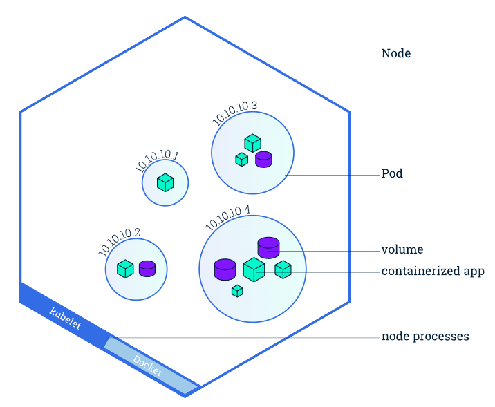

# kubernetes

> kubernetes (K8s) is an open-source platform for managing containerized applications at scale

- automates tasks like deployment, scaling and management of containerized applications
- self-healing: if a container/pod fails, kubernetes automatically replaces it
- declarative configuration and automation
- able to work with multiple cloud-providers simultaneously

[kubernetes documentation](https://kubernetes.io/docs/)
[kubernetes tutorials by katacoda](https://www.katacoda.com/courses/kubernetes)
[docker](/docker.md)

## key components

- pods: smallest deployable unit in kubernetes
  - group of one or more containers
  - shared storage, network, and configuration for containers
  - e.g. a web application might have a frontend pod (running nginx) and a backend pod (running node.js with postgresql)
- node: single physical/visual machine that runs components required to execute/manage containers within pods
  - each node can host multiple pods
  - node types:
    - worker node
      - higher workload
      - higher compute
    - master node
      - more important
      - should have at least 3 replicas
- cluster: group of nodes, highest-level structure in kubernetes
- object: cluster's desired state
- workload: application(s) running on the cluster

- imagine a kubernetes cluster as a city:
  - cluster = the entire city
  - node = a building in the city
  - pod = a single apartment in the building where people (containers) live



- kubernetes cluster architecture:
  - master node (control plane): manages the cluster and schedules workloads
    - kube-apiserver: provides the interaction for management tools (e.g. kubectl or kubernetes dashboard)
    - etcd: key-value storate that holds the current state of the kubernetes cluster
      - basically a cluster backup
    - scheduler: allocates unscheduled pods on different nodes based on the workload
    - controller-manager: set of containers that manages the cluster with actions (e.g. replicating pods)
      - checks if something needs to be repaired or if a container died and needs to be restarted
  - worker nodes: run the application workloads
    - kubelet
      - communicates with control plane to receive and execute workload instructions
      - ensures containers are running and healthy
      - reports node status and pod health back to control plane
    - container runtime: manages lifecycle of container
      - examples: docker, containerd
    - kube-proxy: manages networking rules so that pods and services communicate effectively

## `kinds`

> different types of resources defined in YAML manifests

- used to manage and configure the cluster

### workload resources

- Pod
- Deployment
  - most common way to manage pods
  - ensures specified number of pod replicas are running
  - supports rolling updates and rollbacks
  - used for stateless applications
  - example: deploy a web application with 3 replicas
- ReplicaSet
  - maintains a stable set of replica pods
  - usually managed by deployments
  - ensures specified number of pods are running at all times
- StatefulSet
  - for applications that need stable, unique network identifiers
  - persistent storage per pod
  - example: databases like mongodb, mysql
- DaemonSet
  - ensures all nodes run a copy of a specific pod
  - useful for node monitoring, log collection
  - example: running a logging agent on every node
- Job
  - for one-time tasks
  - ensures pods run to completion
  - example: batch processing, data migration
- CronJob
  - creates jobs on a schedule
  - like unix crontab
  - example: regular backup jobs, scheduled reports

### resources for networking and service discovery

- Service: exposes a group of pods as a network service
  - types:
    - ClusterIP (default): internal communication inside the cluster
    - NodePort: Exposes port on each node
    - LoadBalancer: External load balancer
    - ExternalName: DNS alias
- Ingress: manages external HTTP/HTTPS traffic to services
  - provides routing rules and supports SSL termination
- NetworkPolicy: controls traffic between pods based on rules
  - e.g. route traffic from example.com to specific service

### configuration and secrets management

- ConfigMap: stores non-sensitive configuration data as key-value pairs
  - example: application settings
- Secret: stores sensitive data
  - example: API keys, passwords, certificates

### storage management

- PersistentVolume: physical storage resource in the cluster
- PersistentVolumeClaim: request for storage by an application
- StorageClass: defines different storage types (e.g. SSD, HDD)

### cluster management

- Namespace: creates isolated environments within the cluster
- ResourceQuota: limits CPI, memory and storage per namespace
- LimitRange: sets minimum and maximum resource limits for pods


## Core Concepts with Examples

- YAML Manifest: Kubernetes resources are defined using YAML files
  - apply YAML file: `kubectl apply -f <filename>.yaml`

Pod YAML example:

```yaml
apiVersion: v1
kind: Pod
metadata:
  name: my-pod
spec:
  containers:
  - name: nginx-container
    image: nginx
```

## kubectl

- view nodes: `kubectl get nodes`
- view pods: `kubectl get pods`
- open shell inside running container: `kubectl exec -it <nextjs-pod-name> -- /bin/sh`
- create Secret: `sudo kubectl create secret generic peso-secrets --from-env-file=.env`
- generate Secret yaml file: `kubectl get secret nextjs-env -o yaml`
- ensure Kubernetes cluster is running: `kubectl cluster-info`
- check the pod logs: `kubectl logs <pod-name>`
- check the service status: `kubectl describe service nginx-service`
- create Kubernetes Secret from .env: `kubectl create secret generic peso-secrets --from-env-file=.env.local`
- update Kubernetes Secret :`kubectl delete secret peso-secrets && kubectl create secret generic peso-secrets --from-env-file=.env.local`

```bash
kubectl scale deployment my-deployment --replicas=5
```

## configuration files (yaml)


```yaml
# deployment.yaml

apiVersion: apps/v1
kind: Deployment
metadata:
  name: nextjs-app
spec:
  replicas: 1
  selector:
    matchLabels:
      app: nextjs-app
  template:
    metadata:
      labels:
        app: nextjs-app
    spec:
      containers:
      - name: nextjs
        image: ${IMAGE}
        ports:
        - containerPort: 3000
        env:
        - name: DATABASE_URL
          valueFrom:
            secretKeyRef:
              name: db-secret
              key: DATABASE_URL
      imagePullSecrets:
      - name: ecr-secret
---
apiVersion: apps/v1
kind: Deployment
metadata:
  name: nginx-proxy
spec:
  replicas: 1
  selector:
    matchLabels:
      app: nginx-proxy
  template:
    metadata:
      labels:
        app: nginx-proxy
    spec:
      containers:
      - name: nginx
        image: ${NGINX_IMAGE}
        ports:
        - containerPort: 80
      imagePullSecrets:
      - name: ecr-secret
```

- specifies
  - container image
  - number of pods
  - environment variables
  - resource limits

```yaml
# service.yaml

apiVersion: v1
kind: Service
metadata:
  name: nextjs-service
spec:
  selector:
    app: nextjs-app
  ports:
    - protocol: TCP
      port: 3000
      targetPort: 3000
---
apiVersion: v1
kind: Service
metadata:
  name: nginx-service
spec:
  selector:
    app: nginx-proxy
  ports:
    - protocol: TCP
      port: 80
      targetPort: 80
  type: ClusterIP
```

```yaml
# ingress.yaml

apiVersion: networking.k8s.io/v1
kind: Ingress
metadata:
  name: nextjs-ingress
  annotations:
    nginx.ingress.kubernetes.io/rewrite-target: /
    kubernetes.io/ingress.class: "nginx"
spec:
  rules:
  - http:
      paths:
      - path: /
        pathType: Prefix
        backend:
          service:
            name: nginx-service
            port:
              number: 80
```

## k3s

> lightweight kubernetes that's easy to install

- to run any kubernetes command, add `k3s`
  - e.g.: `sudo k3s kubectl get nodes`

## helm

> package manager for kubernetes

- chart: helm package
- repository: place where charts can be collected and shared
- release: instance of chart running in kubernetes cluster

- one chart can be installed multiple times into the same cluster
  - each time it is installed, a new release is created
