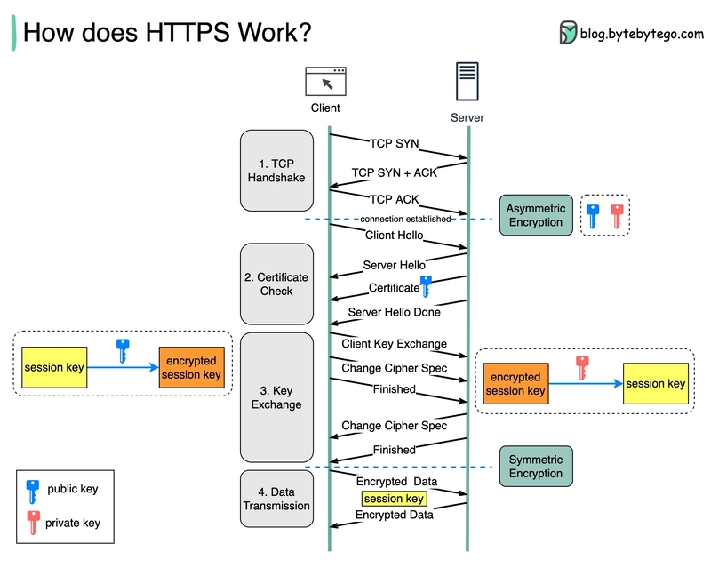

# networking

[web development](./web_development.md)
[aws](./aws.md)

[computer networking: a top-down approach](https://www.amazon.com/Computer-Networking-Top-Down-Approach-7th/dp/0133594149)

## jargon

- what is the internet?
  - computer network that interconnects billions of computer devices throughout the world
  - an infrastructure that provides services to applications

- RFC (Request For Comments): documents that describe proposed standard or best practice for a specific aspect of the internet
- protocol: set of rules and standards that govern the communication between devices on a network
  - what does it define?
    - format of data being sent
    - method of transmission
    - error handling, etc

- packet or encapsulated data: unit of data transmitted over a network
  - includes:
    - header: caintains control information, which is info about data transmission
    - payload: actual data being transmitted (e.g. file, email or web page)
    - trailer (optional): error-checking data or additional control information
  - each layer adds more info
  - packet's name changes for each layer, in the [encapsulation process](#network-encapsulation)
    - e.g. datagram for network layer, frame for link layer

- throughput (bits per second = bps): amount of data per second that can be transferred
- latency (milliseconds = ms): time required for a data packet to travel from the source to destination and return
- bandwidth (bps or GBps): maximum volume of data that can be transferred at one time
- delay:

- endpoint: device or node that is participating in a network communication
  - defined by a combination of [IP address](#ip-internet-protocol) and [port number](#ports)
- socket: mechanism that enables communication between two endpoints via IP address and port

properties of the internet:
- interoperability: different devices can communicate with each other seamlessly
  - this required a set of common protocols and standards
- scalability: able to grow as more devices and networks were added
- reliability: able to withstand failures and errors without disrupting service
- security

- network edge: hosts, access network
- network core: packet circuit switching, internet structure

- host or end system: device that is connected to a network and has the ability to send and receive data over the network
  - hosts access the internet through ISPs (Internet Service Providers)
  - ISP: network of packet switches and communication links
  - there's 2 types of hosts:
    - client: device or application that requests a service or resource from a server
    - server: device or application that provides a service or resource to clients
      - proxy server:
      - reverse proxy server:

- router: connects multiple devices to a network
  - each router has a forwarding table that maps destination addresses to that router's outbound link
  - key functions:
    - packet forwarding: forwards packets of data between devices on the network
    - network segmentation: can segment a network into different subnets
    - Network Address Translation (NAT): allows multiple devices on a single network to share a public IP address
      - helps reduce the need for a large number of public IP addresses
- modem: converts digital data from a computer or network into analog signals for transmission over cables, and vice versa
  - analog signal: signal that varies continuously over time
- switch: device that connects multiple devices together within a network, allowing them to communicate with each other

- firewall: security device or software that monitors and controls incoming/outgoing network traffic based on predefined rules
- gateway: device or system that connects networks together, allowing data to be transmitted between them
  - types of gateways: router, firewall, proxy server, NAT (Network Address Translator)
- route table: determines how traffic is directed in a network
  - set of rules that define where to send traffic based on destination IP
  - each subnet in aws is associated with one route table

- packet switch: takes arriving packet and forwards that packet to the outgoing connection link
- connection links: physical or logical paths over which data is transmitted between devices or networks

## how is data transmitted over the internet?

- packet switching: method of transmitting data in which data is broken into small pieces and transmitted over a network

- data is segmented into small chunks, called packets
  - each packet's size ranges from 46 to 1500 bytes in size
  - each packet is given a unique identifier, called a packet ID
  - packet header: contains information about the packet, such as:
    - source and destination IP addresses
    - packet ID
    - packet length
    - sequence number (to ensure packets are delivered in the correct order)
    - error-checking data (e.g., checksum)
- packet transmission
  - what does data transmitted independently over the network mean?
    - each packet is transmitted separately and independently of other packets
      - unlike a circuit-switched network
    - each packet has its own path
    - each packet is processed independently
  - routing
    - the router analyze the destination IP address in a packet
    - routers use routing tables to decide where to forward the packet next
    - the packet hops from router to router until it reaches its final destination
    - routing protocols dynamically adjust the path based on the state of the network
- packet arrives at destination
- packet reassembly: done in correct order, using the sequence numbers and packet IDs
- error detection and correction
  - destination checks packets for errors, using the error-checking data in the packet header
  - if errors are detected, the packet is retransmitted

## OSI model

[OSI-model explained in a simple way](https://osi-model.com)

**upper layers are closer to software**

7. application layer
  - HTTP, FTP
6. presentation layer
  - ensures data is in a readable format
  - encryption happens here
  - ASCII, JPEG
5. session layer
  - maintains connections and controls ports/sessions
  - syn/ack
4. transport layer
  - transmits data using transmission protocols
  - TCP, UDP, port numbers
3. network layer
  - decides which physical path the data will take
  - IP
2. data link layer
  - ensures error-free data transfer between two connected nodes
  - defines format of data on the network
  - transfers data between network nodes to WAN (Wide Area Network)
  - MAC addresses, ethernet, switches
1. physical layer
  - transmits raw data bits over physical medium
  - USB, RJ45

**lower layers are closer to hardware**

## TCP/IP model

> [!IMPORTANT]
> TCP/IP is the most widely used model
> TCP/IP is a simplified version of OSI model
> TCP/IP model != TCP and IP protocols

- application layer
  - application layer
  - presentation layer
  - session layer
- transport layer
  - transport layer
- network layer
  - network layer
- network access layer
  - data link layer
  - physical layer

> [!WARNING]
> kurose's book splits network access layer into link layer and physical

### application layer

> defines how applications communicate over the network

#### DNS (Domain Name System)

> resolves domain names to IP addresses

- domain name: human-readable name (e.g. `example.com`) used to identify resources on the internet

#### DHCP (Dynamic Host Configuration Protocol)

> assigns IP addresses and other network settings to devices on a network

- responsible for:
  - IP address assignment
  - subnet mask assignment
    - subnet mask:
  - default gateway assignment
    - gateway: device or system that connects networks together, allowing data to be transmitted between them
  - lease time assignment
    - lease time: amount of time the device is allowed to use the assigned IP address and other network settings
    - assigns a lease time for each device
    - when lease time expires, the device must renew its lease or obtain a new IP address
  - renewal and rebinding of IP addresses if the lease time expires

#### FTP

> transfers files over the network

- establishes a connection before sending data, unlike HTTP, which is connectionless
- capable of sending binary files (e.g., images, executables) and text files (e.g., documents, HTML pages)
- not secure: transmits plain text, unencrypted data

#### websocket

> protocol that allows bidirectional, real-time communication between a client and a server over the web

#### webhook

> one-way notification system


- examples:
  - github sending a webhook when a code is pushed
  - stripe sending payment notification

- you register a URL (endpoint)
  - configure a system (e.g. github) to send specific data to your URL when an event happens (e.g. git push)
- the system sends an HTTP request to that URL when a specific event occurs
  - usually a payload (data) in json format
- your server receives it and acts on it

#### HTTP (HyperText Transfer Protocol)

> defines how requests and responses between a client and a server should be formatted and transmitted

[http application in golang](/golang.md#http)

- foundation of data communication on the World Wide Web
- stateless protocol
  - this means that each request from a client to a server is independent, with no memory of previous interactions
- HTTP/3 is built on top of UDP
- HTTP/1 and HTTP/2 are built on top of TCP protocol
  - HTTP vs TCP:
    - TCP provides reliable, ordered, and error-checked delivery of data
    - HTTP defines the format and structure of messages for web communication

- uses client-server architecture
  - client: device or application that initiates an HTTP request
    - e.g. web browser, mobile app
  - server: device or application that processes the request and sends back a response
    - e.g. web server

- request: contains the following elements:
  - HTTP method (like GET or POST)
  - URL
  - HTTP version
  - headers: key-value pairs that provide additional information about the request
    - examples:
      - `Content-Type`: type of content being sent
      - `User-Agent`: client application info
      - `Authorization`: authentication credentials
  - body (optional): contains data being sent from the client to the server (e.g., form data or file uploads)

- response: server's reply to an HTTP request, containing:
  - status line: contains
    - HTTP version
    - status code (e.g., "HTTP/1.1 200 OK")
  - headers: metadata about the response
    - examples:
      - `Content-Type`
        - `application/json`
        - `text/html`
        - `multipart/form-data`
      - `Content-Length`: size of response body
  - body (optional): actual content being sent back
    - HTML for web pages
    - JSON or XML for API responses
    - binary data for file downloads

- HTTP methods:
  - GET: requests data from the server (e.g. retrieving a webpage)
  - POST: submits data to the server (e.g. submitting a form or uploading a file)
  - PUT: complete replacement of existing data on the server
  - DELETE: deletes data from the server
  - PATCH: partially updates data on the server
  - HEAD: similar do GET, but only retrieves headers, not the body
  - OPTIONS: used to describe the communication options available for the target resource
  - TRACE: for diagnostic purposes
    - the client sends a request to the server, which responds with the exact request that it received
  - CONNECT: establishes a secure connection through a proxy server for encrypted communication

- HTTP status codes (obtained from the server's response):
  - 1xx: informational
  - 2xx: success
    - 200 OK: The request was successful, and the server is returning the requested data
    - 201 Created: resource was created successfully
  - 3xx: redirection
    - 301 Moved Permanently: The requested resource has been moved to a new URL
  - 4xx: client error
    - 400 Bad Request: The server could not understand the request due to invalid syntax
    - 401 Unauthorized: The request requires authentication, and the client has not provided valid credentials
    - 404 Not Found: The requested resource could not be found on the server
  - 5xx: server error
    - 500 Internal Server Error: server encountered an unexpected condition that prevented it from fulfilling the request

example of HTTP request

```
GET /index.html HTTP/1.1
Host: www.example.com
User-Agent: Mozilla/5.0
Accept: text/html
```

example of HTTP response

```
HTTP/1.1 200 OK
Content-Type: text/html
Content-Length: 1024

<html>
  <body>
    <h1>Welcome to Example!</h1>
  </body>
</html>
```

- HTTP URL (Uniform Resource Locator)
  - `http://`: specifies that the http protocol will be used for communication

##### HTTP/1 vs HTTP/2 vs HTTP/3

- semantics are consistent across versions
  - same request methods, status codes and message fields
- HTTP1 and HTTP2 use [TCP](#tcp-transmission-control-protocol) as their transport
- HTTP3 uses [UDP](#udp-user-datagram-protocol)

#### HTTPS

> extension of HTTP that uses encryption (via SSL/TLS) to secure the communication between the client and the server



short description of HTTPS communication:

1. client/browser requests server to establish initial request to establish connection
1. server responds with public key and its digital certificate
1. client verifies certificates and extracts public key from response
1. browser generates symmetric key
1. client sends encrypted symmetric key to server
1. server decrypts symmetric key
1. secure connection established
1. data exchange

long example of HTTPS communication:

- when you enter a url in your browser, it sends an initial request to the server to establish a connection
- the server responds with its digital certificate, which includes its public key and identity information (e.g., domain name, organization name)
- your browser verifies the server's identity by checking the digital certificate against a trusted Certificate Authority (CA)
  - if the certificate is valid, your browser extracts the server's public key
- your browser generates a random symmetric key
  - symmetric key: used for encrypting and decrypting the data exchanged between your browser and the server
- your browser encrypts the symmetric key using the server's public key
  - this ensures that only the server, with its corresponding private key, can decrypt the symmetric key
- the server receives the encrypted symmetric key and decrypts it using its private key
- both your browser and the server now have the same symmetric key, which is used to encrypt and decrypt all subsequent data exchanged between them
- your browser and the server can now exchange data securely, using the symmetric key for encryption and decryption

- the client doesn't have its own private key
- the server has a pair of keys: a private and public key
  - server's private key is never shared with the client or any other party
    - it's used exclusively by the server to decrypt the symmetric key and establish a secure connection with the client
  - public key is shared publicly through the server's digital certificate
- the digital certificate contains:
  - server's public key
  - domain name
  - other identifying information

#### SSL (Secure Sockets Layer)

- provides secure communication over a computer network
- deprecated and insecure

#### TLS (Transport Layer Security)

> cryptographic protocol that secures communication over networks

- encryption: prevents third parties from reading the data exchanged between the client and the server
- authentication: uses certificates and Public-Key Infrastructure (PKI) to authenticate the identities of client or server
  - contains the following information:
    - domain name
    - additional subdomains
    - name of issuing CA (Certificate Authority)
    - date of issue
    - expiry date
    - public key used to verify data
  - prevents man-in-the-middle attacks
- integrity: prevents data from being altered during transmission

- successor to SSL
- addresses flaws in SSL
- provides privacy and data integrity between two communicating applications
- TLS handles the encryption of HTTP requests and responses
  - all data transferred via HTTPS is secured by TLS
- TLS handshake
  - when a browser connects to an HTTPS website, it starts with a TLS handshake
  - defines which:
    - version of TLS will be used
    - encryption algorithm will be applied
    - exchange of digital certificates to verify server's identity
  - once the handshake is complete, HTTP data is transmitted over the secured TLS connection

- HTTPS vs TLS
  - HTTPS is the protocol for secure web communication
  - TLS is the security layer that HTTPS uses to encrypt and secure that communication

### transport layer

> provides data transfer between two devices

- breaks data into segments
- ensures it is sent and received properly
- reassembles data at the destination
- provides end-to-end communication between source and destination devices

#### TCP (Transmission Control Protocol)

> enables application programs and computers to exchange messages over a network

- reliable, ordered, error-checked delivery of data
- works on top of IP

3-way handshake (connection setup)

1. client sends SYN (Synchronize) packet to server, requesting to start a connection
1. server responds with a SYN-ACK (Synchronize-Acknowledgment)
1. clients sends final ACK packet to server (Acknowledgment) to confirm
1. connection established

- tcp segment structure
  - header
    - source port
    - destination port
    - sequence number
    - checksum (for error-checking)
    - flags (e.g ACK)
    - etc
  - payload (optional data)
    - can be an http request

#### UDP (User Datagram Protocol)

- connectionless protocol: messages are sent without negotiating a connection and UDP doesn't keep track of what's being sent

- TCP vs UDP:
  - TCP is more reliable
  - TCP is ordered
  - TCP data chunks are called segments
  - UDP is less reliable
  - UDP is not ordered
  - UDP data chunks are called datagrams

### network layer

> responsible for routing packets/datagrams between devices across different networks

- uses IP to handle addressing and routing
- each packet is treated independently, and may take different routes to reach the destination

#### IP (Internet Protocol)

> google.com (domain name) => 142.251.135.142 (ip address)

- IPv4
  - e.g. `185.107.80.231` <=> `10111001.01101011.01010000.11100111`
  - `byte.byte.byte.byte` <=> `(8 bits).(8 bits).(8 bits).(8 bits)`
  - 4 bytes = 32 bits
  - `(0 to 255).(0 to 255).(0 to 255).(0 to 255)`
- IPv6
  - 16 bytes = 128 bits
  - `2bytes:2bytes:2bytes:2bytes:2bytes:2bytes:2bytes:2bytes` <=> `2800:3f0:4004:809::200e`
  - `16bits:16bits:16bits:16bits:16bits:16bits:16bits:16bits` <=> `2800:3f0:4004:809::200e`
    - double colon `::` = `0000 0000 0000 0000` represents 16 consecutive zero bits

> [!TIP]
> IPv4 32 bits => 432 => 4 bytes and 32 bits
> IPv4 bytes * 2² bytes => IPv6
> 32 bits * 2² = 128 bits

- CIDR (Classless Inter-Domain Routing) notation: compact way to represent IP ranges (e.g. `192.168.1.0/24`)
  - `192.168.1.0/24` has two parts
    - network address or starting IP (`192.168.1.0`): identifies the subnet or block of IPs
    - prefix length (`/24`): defines how many bits are reserved for the network
      - can go from `/0` to `/32`, but most common subnet size is `/24`
        - in aws, prefix lengths for subnets must be between `/16` and `/28`
    - `/24` = the first 24 bits (`192.168.1`) are fixed and define the network
      - the remaining 8 bits (32-24) are available to assign to hosts (devices)
        - 8 bits => 2⁸ = 256 IPs
      - `/24` can be splitted into two subnets
        - `192.168.1.0/25` => IPs from `.0` to `.127`
        - `192.168.1.128/25` => IPs from `.128` to `.255`

| Feature          | Public IP | Private IP |
|-----------------|----------|-----------|
| Scope      | Global (Internet) | Local (LAN) |
| Uniqueness | Unique worldwide | Unique within a local network |
| Assigned by | ISP or cloud provider | Router (via DHCP) or manually |
| Accessibility | Accessible from the internet | Not accessible from the internet directly |
| Cost | Often requires payment | Free to use |
| Example | `8.8.8.8` (Google DNS) | `192.168.1.1` (Wi-Fi router) |

### network access layer

> handles communication between hardware and the network

- hardware example: [network interface card](https://en.wikipedia.org/wiki/Network_interface_controller)
- protocol examples: Ethernet, Wi-Fi, PPP, MAC
- organizes data into frames for transmission
- manages MAC addresses for network devices

#### MAC (Media Access Control)

- unique identifier attributed to each network interface of a device connected to the network
- MAC address uses 6 bytes = 48 bits
- `byte:byte:byte:byte:byte:byte`
- example: `47:3E:2A:B2:11:24`

---

## ports

> communication endpoint used by computers to identify specific processes or services

- helps the OS to direct incoming requests or data streams to the correct application

- ports are numbered from 0 to 65.535 (2^16)
  - protocols are associated with specific port numbers
  - ports from 0 to 1.023 are known as well-known ports
  - ports from 1.024 to 49.151 are known as registered ports
  - ports from 49.152 to 65.535 are known as dynamic or private ports

- each port can only be used by 1 program at a time
- the port component of a URL is often not visible when browsing the internet, because almost always you're using default ports
  - `http://example.com:80/?search=test` = `http://example.com/?search=test`

- when computer 1 connects to computer 2, it connects to a specific port on computer 2
  - which is listened to by the by a program on computer 2

- FTP 20/21
- SSH 22
- TELNET 23
- SMTP 25
- DNS 53
- DHCP 67/68
- HTTP 80
- HTTPS 443
- DHCPv6 546/547

---

## network encapsulation

> process of concatenating layer-specific headers with information data for trasmitting information over networks

[encapsulation](https://www.geeksforgeeks.org/how-data-encapsulation-de-encapsulation-works/)

- it's a 2-step process: encapsulation and decapsulation
- packet or encapsulated data: original data + headers added for each layer
  - each layer adds more info
- PDU (Protocol Data Unit): unit of data that is transmitted over network
  - specific to each layer of the OSI

| layer | PDU |
| --- | --- |
| 7 | data |
| 6 | data |
| 5 | data |
| 4 | segment/datagram |
| 3 | packet |
| 2 | frame |
| 1 | bits |

- application/presentation/session layers: no additional information will be added to the data
- transport layer: data is broken in chunks, each chunk will receive a header with info
  - what info? source port, destination port, sequence number, etc
    - usually the info is called L4 (Layer 4) header
  - the encapsulated data's name depends on the protocol used:
    - if the transmission uses TCP, it's segments
    - if the transmission uses UDP, it's datagrams
- network layer: more info will be added (source IP address, destination IP address, etc)
  - encapsulated data is now called packet
- data link layer: add MAC address, destination MAC address, etc
  - encapsulated data is now called frame
- physical layer
  - encapsulated data is now bits

example of encapsulation process:

1. application layer: HTTP request is created
1. presentation layer: data can be encrypted or compressed (e.g. HTTPS encryption via SSL/TLS)
1. session layer: data remains unchanged
1. transport layer: HTTP request (data) is divided into smalled chunks, called segments
1. network layer: each segment is encapsulated into packets, which contains source and destination IP addresses
1. data link layer: packet is placed inside a frame, which contains source and destination MAC addresses
1. physical layer: frame is converted into a stream of bits

## Static and Dynamic IP Addressing

TODO

## network bonding and bridging

TODO

## VLANs

TODO

## DNS Configuration

TODO

## Network Interfaces

TODO

## Basic Network Troubleshooting

TODO

### ping

> test the reachability of a host on an IP network

- `ping [hostname]`: sends ICMP echo request packets to the specified host

### traceroute

TODO

### netstat

TODO

---

- NAT (Network Address Translation): converts private IPs to public IPs
- firewalls: control network traffic based on rules
  - security groups (aws): stateful filtering for inbound/outbound traffic
- CDN (Content Delivery Network)
  - caches static content (images, css, js) at edge locations globally
  - reduces latency by serving users from the nearest data center
  - examples: cloudflare, aws cloudfront, akamai
