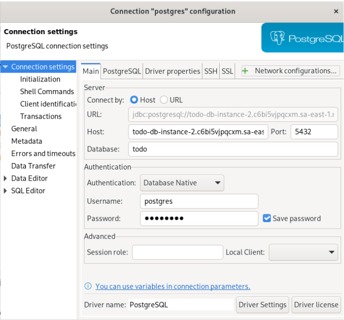

[web development](./web_development.md)


## basic steps

1. create and clone github repository
2. create a directory for client and another for server or setup the frameworks for each
  - `mkdir my_project`
  - `cd my_project`
  - `npx create-next-app@latest .`
    - initializes a new Next.js project in the current directory

3. setup the frameworks for each 


## Setting up PostgreSQL locally

1. Install PostgreSQL on the official site
  - You may need to use `sudo postgresql-setup --initdb`. Without `sudo`, it sometimes doesn't work.
  - You may need to edit the `.conf` file:
    - `sudo nvim /var/lib/pgsql/data/pg_hba.conf`
    - On `pg_hba.conf` replace:
      - `local all all ident`
      - with:
      - `local all all trust`
  - Restart PostgreSQL service: `sudo service postgresql restart`
  - Access PostgreSQL CLI as postgres superuser: `sudo psql -U postgres`
2. When creating a Pool of connection on the server, you might need to change `pg_hba.conf` file
  - If you get the error:
    ```
    [nodemon] starting `node server.js index.js`
    listening on port 5000
    error: Ident authentication failed for user "postgres"
    ```
  - You might need to edit the `pg_hba.conf` file:
    - `sudo nvim /var/lib/pgsql/data/pg_hba.conf`
    - Replace "ident" with "md5" or "trust"
    - I replaced with md5 on the todo pern project

## REST API server with Node/Express

1. Create backend folder.
2. `cd` into backend folder:
  - `npm init -y`
  - `npm install express`
3. Create `server.js`.
4. Import modules:
  - ```javascript
    const express = require("express");
    // Express "summarizes" the code for http requests
    ```
  - `dotenv`: reads `.env` file and stores the environment variables that are confidential. Don't push it to GitHub.
  - ```javascript
    const app = express();
    // Create an instance of an express application
    ```
5. Use middlewares (`cors()` and `express.json()`):
  - Middleware: In Express.js, middleware functions are functions that have access to the request (req) and response (res) objects in the request-response cycle. They can perform tasks like parsing the request, modifying the response, or passing control to the next middleware in the stack.
  - `app.use(cors())`: allows requests from different domains.
    - In the code you provided, `const cors = require('cors');` is used to import the "cors" middleware for an Express.js application. The "cors" middleware stands for Cross-Origin Resource Sharing and is used to enable or control cross-origin requests in a web application. Let me explain what it does:
  - `app.use(express.json())`: allows the interpretation of JSONs by making them available as JavaScript objects.
6. Write API:
  - List an instance of a table: `app.<http_verb>("<endpoint path>", async (req, res) => { })`
    - Try: `const results = db.query("<SQL query>");` runs a SQL query via `db` object.
    - `console.log(results);`
    - `res.status(200).json`: send a response to the machine that originally made the request with the code of the operation (200) and the results in JSON format.

## Setting up and connecting to RDS PostgreSQL instance

1. Create RDS instance:
  - Choose PostgreSQL.
  - Make sure security groups are enabled (which ports?).
  - Define password username.
2. Open DB manager.
3. Start new connection:
  - Choose PostgreSQL.
  - Fill up credentials according to the provided image (not included in Markdown).



## Front-end React

### React hooks

- useState: Update state of a variable.
  - `const [todos, setTodos] = useState('');`
    - Returns an array with two elements: the variable and a function to update it.
    - Initial value is an empty string.
- useEffect: Manage component lifecycle, which includes:
  - Create component
  - Update component
  - Delete component

### React events

- Event types: User events, keyboard events, mouse events, asynchronous events, etc.
- Examples of events: `onClick`, `onChange`, `onSubmit`, `onMouseOver/onMouseOut`, `onKeyPress/onKeyDown`.

### Structure of functional React component

```javascript
import React, { Fragment, useState } from "react";
const <component_name> = () => {
  const [attribute, setAttribute] = useState(<object.attribute>);
};
```
